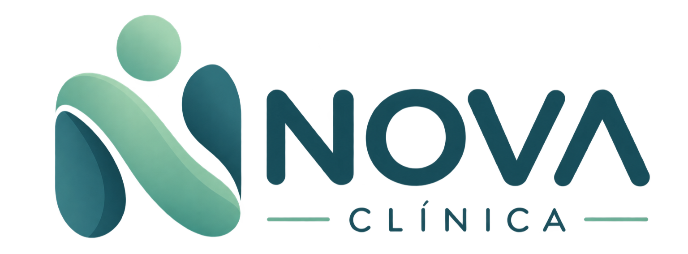
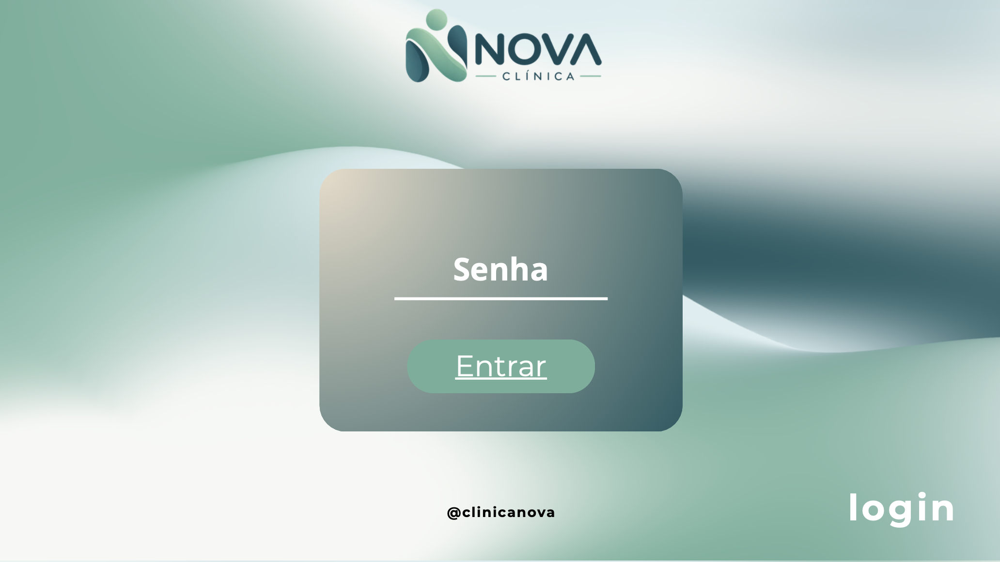
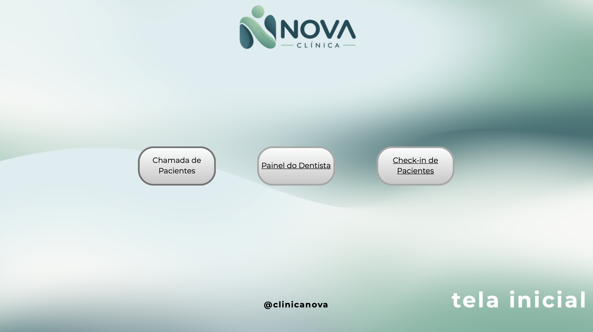
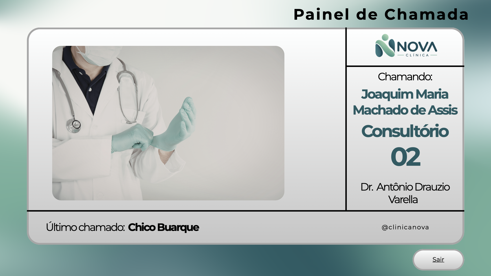
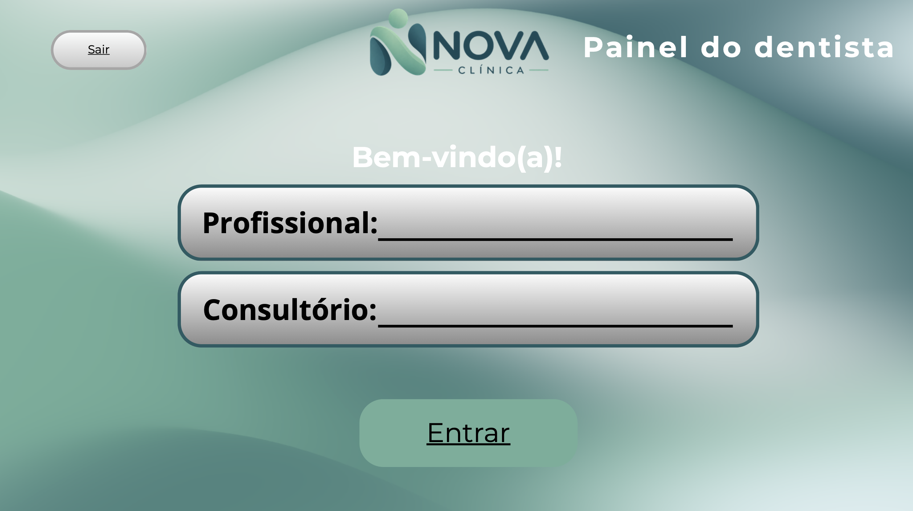
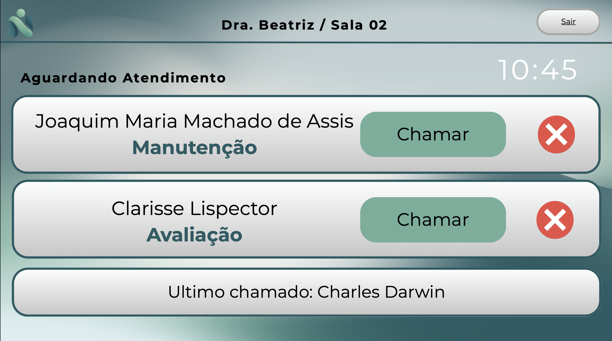
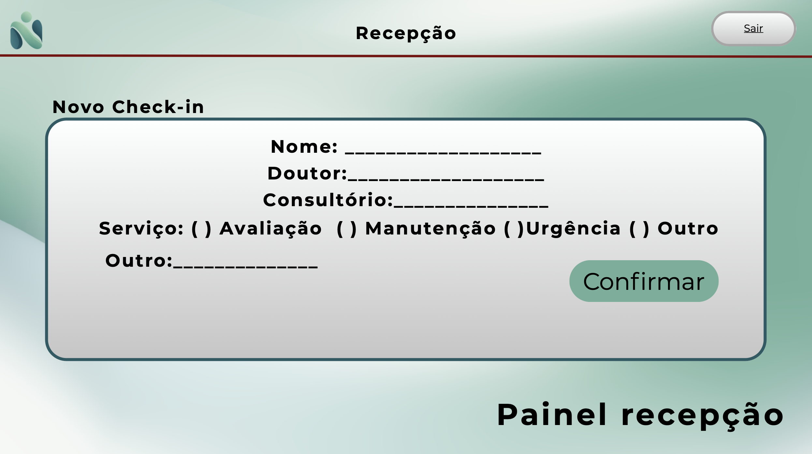
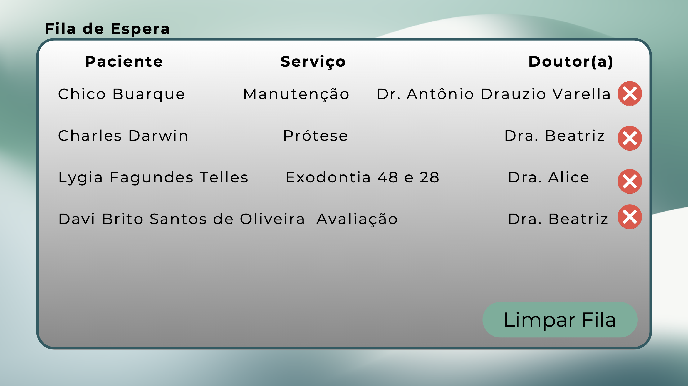

## Objetivo

Transformar a solução escolhida em uma representação visual e testável.

## Possibilidades

- Protótipo de papel
- Wireframe
- Figma
- Canva
- Storyboard
- Protótipo de alta fidelidade

## Princípio

O protótipo não precisa ser um produto funcionando.

Ele deve ser suficiente para que usuários possam interagir com a ideia e fornecer feedback.

## Produção

Desing com cores que combinem com a logo da clínica.

```
Cores principais:
VERDE SAGE
#6FAF9A

AZUL PETRÓLEO
#245B63

OFF-WHITE
#F7F8F5

AZUL CLARO
#DCEEF0

AREIA
#E9DCC9
```


### Resumo da identidade

**Nome:** NOVA Clínica  
**Slogan:** _Seu cuidado, mais simples._  
**Conceito:** Saúde centrada no paciente  
**Estilo:** Minimalista, moderno e humano  
**Cor principal:** Verde Sage `#6FAF9A`  
**Cor secundária:** Azul Petróleo `#245B63`  
**Fundo:** Off-White `#F7F8F5`  
**Logo:** Símbolo abstrato formado por duas formas que remetem a cuidado/pessoa e formam um **N**  
**Público:** Pacientes de uma clínica multidisciplinar  
**Produto do protótipo:** Portal/app da clínica

---

---
### Telas (Protótipo)

#### Login


#### Tela Inicial


#### Painel de Chamada


#### Login Dentista


#### Painel Dentista


#### Painel Recepção


